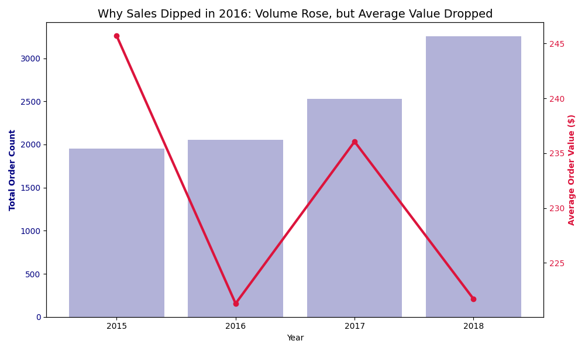

# 📊 Sales Performance Analysis (2015–2018): Revenue Drivers, Risk, and Growth Levers

This project analyzes four years of transactional sales data to identify **where revenue is generated, where it is fragile, and what is driving growth versus volatility**.

Using Python-based analysis, the goal is not just to describe past performance, but to surface **actionable insights for revenue strategy, category focus, and customer management**.

---

## 🎯 Business Problem

Leadership questions this analysis answers:

- Where is revenue actually coming from?
- How concentrated is that revenue?
- Are we growing through volume, value, or both?
- Which products and categories deserve increased investment?
- Where are we exposed to hidden revenue risk?

---

## 🔍 Analysis Scope

The project evaluates organizational performance across four dimensions:

✔ **Revenue Trends Over Time** – Growth, decline, and recovery patterns  
✔ **Product-Level Contribution** – High-value vs low-impact SKUs  
✔ **Category & Sub-Category Performance** – Portfolio concentration analysis  
✔ **Customer Concentration** – Dependence on top customers  
✔ **Volume vs Value Dynamics** – Understanding revenue dips beyond surface metrics  

---

## ⚙️ Tools & Technologies

- Python  
- Pandas for data cleaning and aggregation  
- Matplotlib for trend and comparison visualizations  
- Jupyter Notebook for exploratory and narrative analysis  

---

## 📈 Revenue Performance Overview

The business generated **$2.25M** in total revenue between 2015 and 2018.

| Year | Total Sales |
|----:|------------:|
| 2015 | $479,856 |
| 2016 | $454,316 |
| 2017 | $597,226 |
| 2018 | $721,210 |

**Key Observation**
- Revenue dipped in 2016 but rebounded strongly, reaching a peak in 2018
- Growth momentum is real, but **not evenly distributed**

---

## 🧠 Revenue Concentration & Portfolio Risk

### Product-Level Concentration

> The **Canon imageCLASS 2200 Advanced Copier** is the single highest revenue contributor across the entire period.

This indicates:
- Strong performance from high-ticket items
- **Potential over-reliance on a narrow set of SKUs**

At the other end:
> Low-value consumables such as the *Eureka Disposable Bag* contribute negligible revenue while still consuming operational attention.

**Decision Signal:**  
Trim or bundle low-impact products to reduce complexity and improve margin focus.

---

### Category & Sub-Category Dependence

> **Technology** dominates total revenue, with **Phones** as the strongest sub-category.

This is a strength, but also a **concentration risk**:
- Portfolio performance is heavily tied to one category
- Downturns or supply shocks in Technology would disproportionately affect revenue

**Decision Signal:**  
Either double down on Technology with defensive strategies, or deliberately diversify category exposure.

---

## 👤 Customer Concentration Risk

> **Sean Miller** is the single highest revenue-generating customer.

While valuable, this introduces:
- Dependency risk
- Revenue volatility if churn occurs

**Decision Signal:**  
Replicate this customer profile and reduce reliance on single-account performance.

---

## 🔎 Explaining the 2016 Revenue Dip

Despite lower total revenue in 2016:
- **Order volume increased**
- **Average order value declined**

This confirms:
- Demand did not weaken
- Customers shifted toward lower-priced purchases

**Decision Signal:**  
Pricing, discounting, or product mix — not customer demand — caused the dip.

---

## 💡 Strategic Takeaways

1. **Revenue growth is real but concentrated**  
   High dependency on Technology and a small number of products increases risk.

2. **2016 was a value problem, not a demand problem**  
   Growth strategies should focus on **increasing order value**, not traffic.

3. **Low-impact SKUs dilute focus**  
   Product rationalization could improve margins and operational efficiency.

4. **Customer concentration needs management**  
   Top-customer strategies should include replication, not dependence.

---

## 🚀 Who This Analysis Is For

- Sales leadership evaluating category focus  
- Operations teams managing product portfolios  
- Analysts supporting revenue strategy and forecasting  
- Decision-makers who need clarity, not dashboards  

---

## 🙌 Contributing

Feel free to fork this repository and adapt the framework for:
- Retail analytics
- SaaS revenue analysis
- B2B sales performance reviews

---

## 📬 Contact

**Fareed Ologundudu**  
LinkedIn: https://www.linkedin.com/in/fareed-ologundudu-129506249/  
GitHub: https://github.com/Fareed04
