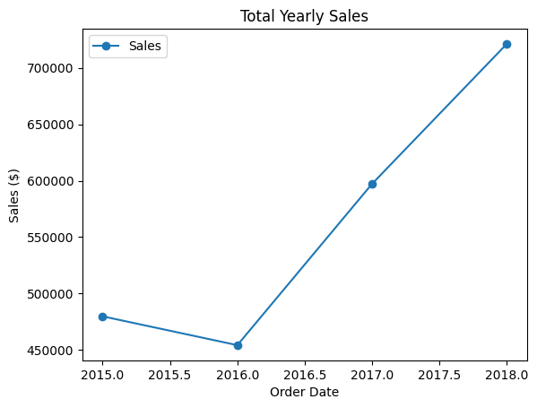

# 📊 Sales Performance Analysis (2015–2018)

I have analyzed four years of business transaction data to identify the core drivers of revenue and growth. Using a dataset of historical sales, this project provides a detailed breakdown of **revenue trends, product success, category dominance,** and **key customer contributions**. By transforming raw data into actionable business intelligence, this analysis uncovers valuable insights into market performance, helping distinguish high-value assets from underperforming inventory.

---

## 🔍 Project Overview

This Python-powered data analysis project examines four years of sales records to evaluate and visualize organizational performance metrics, including:

✔ **Revenue Growth Trends** – Tracking the recovery and surge in sales from 2015 to 2018  
✔ **Product Benchmarking** – Identifying the highest and lowest grossing products  
✔ **Category Dominance** – Analyzing which market sectors drive the most value  
✔ **Sub-Category Insights** – Drilled-down analysis of high-performing niches like Phones  
✔ **Customer Profiling** – Pinpointing the top individual contributor to total sales volume  

---

## 📈 Features & Visualizations

This project includes clear and informative visualizations to communicate business health:

- 📈 **Line / Bar Charts** – Visualizing revenue growth across years  
- 📊 **Comparative Analysis** – Side-by-side performance of categories (Technology vs others)  
- 📑 **Data Summaries** – Aggregated tables showing yearly performance and product rankings  

---

## ⚙️ Tools & Technologies Used

- **Python**
- **Pandas** – data cleaning, aggregation, and analysis
- **Matplotlib** – financial trend visualizations
- **Jupyter Notebook** – exploratory data analysis and documentation

---

## 🚀 Getting Started

### 1️⃣ Clone the Repository

```bash
git clone https://github.com/Fareed04/sales-performance-analysis.git
cd sales_performance_analysis
````

### 2️⃣ Install Dependencies

```bash
pip install -r requirements.txt
```

### 3️⃣ Run the Analysis

```bash
jupyter notebook 01_data_overview.ipynb
```

---

## 📈 Financial Revenue Trends



The business generated a total of **$2,252,607.18** in sales over the four-year period. After a slight dip in 2016, revenue rebounded strongly, peaking in 2018 — indicating sustained recovery and growth momentum.

| Order Year | Total Sales (USD) |
| ---------: | ----------------: |
|       2015 |       $479,856.18 |
|       2016 |       $454,315.77 |
|       2017 |       $597,225.62 |
|       2018 |       $721,209.61 |

---

## 🧠 Sample Insights

**Top Performer**

> The **Canon imageCLASS 2200 Advanced Copier** is the leading revenue driver across the four-year span, demonstrating the importance of high-ticket technology products.

**Underperformer**

> The **Eureka Disposable Bag for Sanitaire Vibra Groomer I Upright Vac** recorded the lowest sales, suggesting a need to reassess low-margin consumables.

**Category Leader**

> **Technology** is the highest-grossing category, with **Phones** emerging as the top-selling sub-category and a core strength of the portfolio.

**Key Customer**

> **Sean Miller** generated the highest total sales revenue, highlighting the value of focused account management for top customers.

---

## 🙌 Contributing

You are welcome to fork this repository, replace the dataset, and adapt the analysis logic to your own business or domain use cases.

---

## 📬 Contact

**Your Name**
Connect with me on [LinkedIn](https://www.linkedin.com/in/fareed-ologundudu-129506249/)
View more projects on [GitHub](https://github.com/Fareed04)

```
